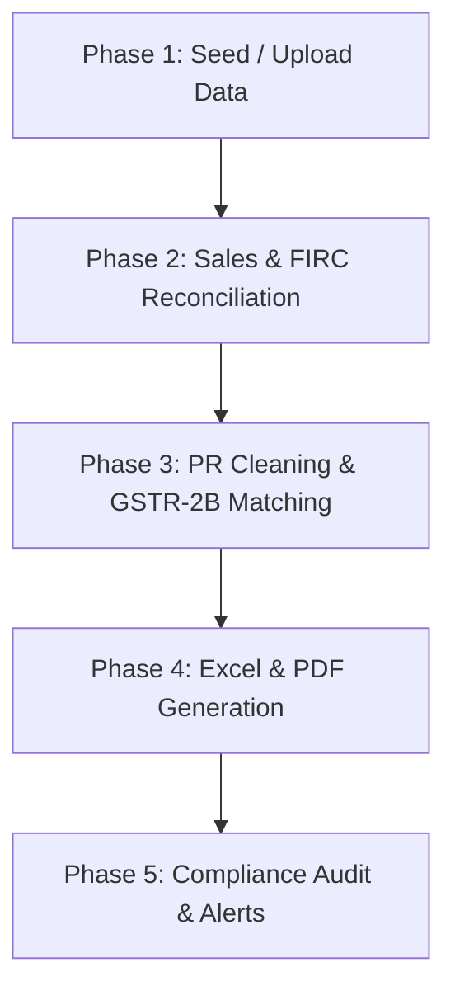

# GST Refund Tool (SSPL Refund Workflow)

An automated tool designed to process, reconcile, and generate documentation for Goods and Services Tax (GST) refund claims. The project matches export sales invoices to Foreign Inward Remittance Certificates (FIRCs), standardizes the Purchase Register, matches purchases to GSTR-2B data, performs compliance audits, and generates the master Excel workbook and PDF reports required for GST filing.

---

## 🛠️ Tech Stack

*   **Backend:** FastAPI (Python), SQLAlchemy ORM, Uvicorn, Pandas, Openpyxl, ReportLab (for PDF generation), Pyxlsb
*   **Database:** SQLite (local database)
*   **Frontend:** React (Vite, CSS Modules / Vanilla CSS)
*   **Version Control:** Git

---

## 🔄 GST Refund Workflow

The system automates the end-to-end refund workflow in four distinct phases:



### 1. Phase 1: Data Initialization
*   **Client Profile Setup:** The user enters the client's GSTIN, legal name, LUT (Letter of Undertaking) number, and LUT validity period.
*   **Data Seeding:** The source datasets (including Invoice Registers, FIRC Registers, Purchase Registers, and GSTR-2B records) are seeded from the master `.xlsb`/`.xlsx` workbooks into the SQLite database.

### 2. Phase 2: Sales and FIRC Reconciliation
*   Export invoices are matched to FIRC records.
*   The system consumes foreign currency from the FIRCs to cover the INR value of the export invoices, tracking remaining FIRC balances and flag gaps (unreconciled exports).

### 3. Phase 3: Purchase Register (PR) Standardization and GSTR-2B Matching
*   **PR Cleaning:** Standardizes supplier GSTINs, identifies import invoices (`IMPS`) and Reverse Charge Mechanism (`RCM`) transactions.
*   **GSTR-2B Matching:** Automatically matches the standardized Purchase Register records against the downloaded GSTR-2B ledger using invoice number, date, and tax values.

### 4. Phase 4: Output Generation
*   **Master Working Excel:** Computes the Net ITC, zero-rated turnover, adjusted total turnover, and calculates the maximum refund allowed under Rule 89(4) of the CGST Rules. Generates `Master_Refund_Working.xlsx`.
*   **Filing PDFs:** Automatically generates the 10 standard compliance PDF statements required for upload to the GST Portal.

### 5. Phase 5: Compliance Audit & Alerts
*   **LUT Validity Audit:** Warns if the refund application period falls outside the active LUT start/end dates.
*   **FIRC Gap Alerts:** Identifies export invoices issued without a linked FIRC.
*   **Period Overlap Check:** Prevents duplicate claims covering the same dates.

---

## 📂 Project Directory Structure

```text
AIyu/
├── backend/                   # Python FastAPI Backend
│   ├── app/
│   │   ├── engine/            # Core processing engines
│   │   │   ├── excel_generator.py # Excel workbook generator
│   │   │   ├── matching.py        # PR to 2B matching logic
│   │   │   ├── pdf_generator.py   # PDF Statement generators
│   │   │   ├── pr_processor.py    # Purchase Register cleaning logic
│   │   │   ├── reconciliation.py  # Sales & FIRC matching engine
│   │   │   └── sspl_loader.py     # Database seeding scripts
│   │   ├── config.py          # Environment settings
│   │   ├── database.py        # SQLAlchemy models and schema definitions
│   │   ├── main.py            # API routing and application endpoints
│   │   └── schemas.py         # Pydantic schemas
│   ├── data/                  # SQLite db, uploaded source files, and outputs
│   ├── requirements.txt       # Python dependencies
│   └── test_refund_tool.py    # Backend integration test suite
│
├── frontend/                  # React Frontend (Vite)
│   ├── src/
│   │   ├── App.jsx            # Main React Dashboard and workspace UI
│   │   ├── App.css            # Stylesheets
│   │   └── main.jsx
│   ├── package.json           # Node.js dependencies and run scripts
│   └── vite.config.js         # Vite configuration
│
└── README.md                  # Project overview and workflow documentation
```

---

## 🚀 Running the Project Locally

There are two ways to run this project on any desktop: **One-Click Scripts (Native)** and **Docker Containerization**.

### 🐳 Option A: Using Docker (Recommended for Portability)
If you have **Docker** and **Docker Compose** installed, you can launch the complete stack with a single command from the root directory:
```bash
docker compose up --build
```
* **Frontend:** `http://localhost:5173`
* **Backend API & Swagger Docs:** `http://localhost:8000/docs`

---

### 🖱️ Option B: One-Click Startup Scripts (Native)
We provide easy launcher scripts at the root level which check for Docker, and if not running, automatically start both servers natively:

*   **Windows:** Double-click `run.bat` or run:
    ```cmd
    run.bat
    ```
*   **macOS / Linux:** Run:
    ```bash
    chmod +x run.sh
    ./run.sh
    ```

---

### 💻 Option C: Manual Native Setup (Step-by-Step)

Ensure you have **Python 3.10+** and **Node.js 18+** installed locally.

#### 1. Backend Setup & Run

Navigate to the `backend` folder:
```bash
cd backend
```

Create and activate a virtual environment (if not already done):
```bash
# Windows
python -m venv venv
.\venv\Scripts\activate

# macOS/Linux
python3 -m venv venv
source venv/bin/activate
```

Install requirements:
```bash
pip install -r requirements.txt
```

Run the FastAPI backend:
```bash
python -m uvicorn app.main:app --reload --port 8000
```
*   **API Base URL:** `http://localhost:8000`
*   **Swagger API Docs:** `http://localhost:8000/docs`

---

### 3. Frontend Setup & Run

Navigate to the `frontend` folder:
```bash
cd ../frontend
```

Install packages:
```bash
npm install
```

Run the Vite React development server:
```bash
npm run dev
```
*   **Frontend URL:** `http://localhost:5173/`

---

## 📤 Git Remote and Publishing Changes

To push new commits to your GitHub repository:
```bash
git add .
git commit -m "Your commit message"
git push -u origin main
```
